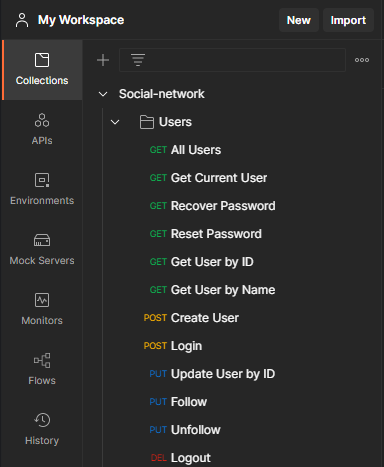

# Social Network - Mongoose
This Social Network is a database for a simple social network created with mongoose. 

## TECHNOLOGIES 🛠️
This database was created using Javascript, Node.js, Express, MongoDB, mongoose, Multer, Bcrypt, Nodemailer, jsonwebtoken. The code was written in Visual Studio Code.

### REQUIREMENTS 📋
Visual studio code. Node.js installed. MongoDBcompass installed. Postman installed.

### HOW TO RUN THIS PROJECT 🔧
## Geting Started 🚀
- Clone this repository `https://github.com/ivanpuebla10/proyectoback2`
- Install the dependencies `npm install`
- Create a new repo on GitHub: `https://github.com/new`
    - Make sure the "Initialize this repository with a README" option is left unchecked
- Update the remote to point to your GitHub repository: git remote set-url origin `https://github.com/YOUR_GITHUB_USERNAME/YOUR_REPOSITORY_NAME`

## Working on the project 👷‍♂️
* Move into the project directory: `cd ~/YOUR_PROJECTS_DIRECTORY/YOUR_PROJECT_NAME`
* Run the project with : `npm run dev`
    * Server runs at [localhost](https://localhost:3000)
    * Automatically restarts when any of your files change

Using Postman you can see what the database brings and send requests. To see what is happening with databases the program is creating open MongoDB and explore them. There is an autentication implemented and there are also roles, so yo must get logged in order to create, comment or like posts, and follow other users. Also, if you want to update or delete a post or comment, yo must be the author, what is another instance of authentication.

## Basic endpoints

* Get all users in db: `http://localhost:3000/users`
* Get all posts in db: `http://localhost:3000/posts` 

### Previews

Database in MongoDB:

Database in MongoDB:

Database in MongoDB:

Database in MongoDB:

Folders organization:

## Author ✒️
* **Ivan Puebla** - *The Bridge* - [ivanpuebla10](https://github.com/ivanpuebla10)